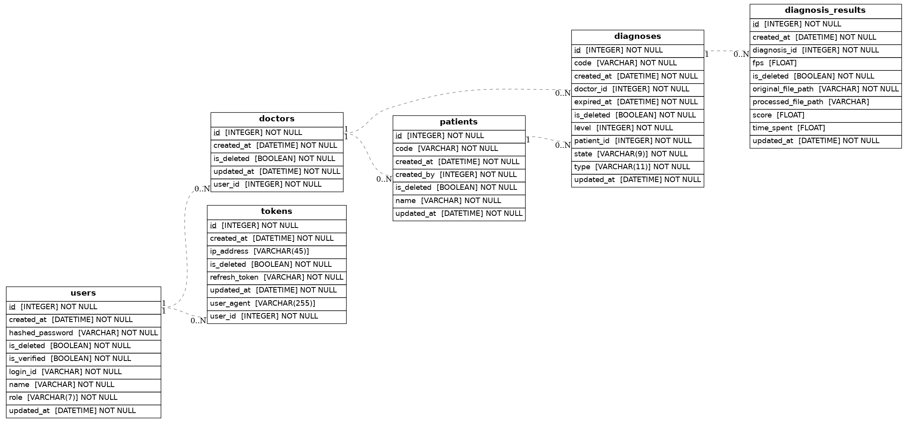

# DAT-web API Server (FastAPI)

## 관련 문서

- [API 개발 가이드](docs/api.md) - API 개발 가이드
- [S3 개발 가이드](docs/s3.md) - LocalStack을 이용한 S3 스토리지 개발 가이드


## 1. 개요

이 문서는 DAT-web 프로젝트의 백엔드 API 서버에 대한 기술적인 내용을 상세히 설명합니다. 이 서버는 FastAPI를 기반으로 구축되었으며, 사용자 인증, 환자 관리, 실시간 진단 세션 관리, 진단 결과 저장 및 분석 등 다양한 기능을 제공합니다.

주요 기능은 다음과 같습니다:
- **사용자 관리 및 인증**: JWT(JSON Web Tokens)를 사용한 안전한 사용자 회원가입, 로그인, 로그아웃 및 세션 관리.
- **환자 및 의사 관리**: 의사가 환자를 등록, 조회, 수정, 삭제하는 기능.
- **실시간 진단 세션**: WebSocket과 SSE(Server-Sent Events)를 활용하여 VR 클라이언트(환자)와 웹(의사) 간의 실시간 상호작용을 지원합니다.
- **진단 데이터 처리**: VR 클라이언트로부터 수신한 진단 결과(CSV)를 처리하고, 분석하여 점수를 산출합니다.
- **파일 스토리지**: 진단 결과 원본 및 가공된 파일을 AWS S3 또는 로컬 개발 환경의 LocalStack에 저장합니다.
- **데이터베이스 관리**: SQLAlchemy ORM과 Alembic을 사용해 데이터베이스 스키마를 관리하고 마이그레이션을 수행합니다.

## 2. 기술 스택

- **프레임워크**: FastAPI
- **데이터베이스**: PostgreSQL
- **ORM**: SQLAlchemy (with Alembic for migrations)
- **인증**: JWT (python-jose, passlib)
- **API 명세**: OpenAPI (Swagger UI, ReDoc)
- **데이터 검증**: Pydantic
- **스토리지**: AWS S3 (로컬 개발 시 LocalStack)
- **실시간 통신**: WebSockets, Server-Sent Events (SSE)
- **의존성 주입**: FastAPI Depends
- **테스팅**: Pytest

## 3. 프로젝트 구조

```
backend/
├── alembic.ini             # Alembic 설정 파일
├── app/                    # 핵심 애플리케이션 코드
│   ├── configs/            # 환경 변수, 데이터베이스 연결 등 설정
│   ├── controllers/        # API 엔드포인트(라우터) 정의
│   ├── core/               # WebSocket 연결 관리, 템플릿 등 핵심 로직
│   ├── dependency/         # 서비스 및 리포지토리 의존성 주입
│   ├── dtos/               # Data Transfer Objects (계층 간 데이터 전달용)
│   ├── middleware/         # User-Agent 검증 등 커스텀 미들웨어
│   ├── models/             # SQLAlchemy 데이터베이스 모델
│   ├── repositories/       # 데이터베이스 접근 로직 (Repository Pattern)
│   ├── schemas/            # Pydantic 스키마 (API 요청/응답 데이터 검증)
│   ├── services/           # 비즈니스 로직 (Service Layer)
│   ├── tests/              # Pytest 테스트 코드
│   └── utils/              # 시간 변환 등 유틸리티 함수
├── docs/                   # ERD, API 문서 등 관련 문서
├── migrations/             # Alembic 데이터베이스 마이그레이션 파일
│   ├── versions/           # 마이그레이션 버전 스크립트
│   ├── env.py              # Alembic 실행 환경 설정
│   └── reset_db.py         # 개발용 DB 초기화 스크립트
├── templates/              # Jinja2 HTML 템플릿 (Mock VR Client용)
├── main.py                 # FastAPI 애플리케이션 진입점
└── s3.md                   # LocalStack을 이용한 S3 개발 가이드
```

## 4. 아키텍처 및 주요 개념

### 계층형 아키텍처 (Layered Architecture)
- **Controller**: HTTP 요청을 받아 적절한 서비스 함수를 호출하고, 결과를 HTTP 응답으로 반환합니다.
- **Service**: 비즈니스 로직을 처리합니다. 여러 리포지토리를 조합하여 복잡한 작업을 수행할 수 있습니다.
- **Repository**: 데이터베이스와의 상호작용을 추상화합니다. CRUD 연산을 담당하며, Service 계층에 데이터를 제공합니다.
- **DTO (Data Transfer Object)**: 각 계층 간에 데이터를 전달하기 위한 객체입니다. SQLAlchemy 모델과 API 스키마로부터 독립성을 유지하여 유연성을 높입니다.

### 의존성 주입 (Dependency Injection)
FastAPI의 `Depends` 시스템을 활용하여 서비스와 리포지토리의 의존성을 관리합니다. `app/dependency/dependency.py` 파일에서 서비스 인스턴스를 생성하고 캐싱하여 컨트롤러에 주입합니다. 이를 통해 코드의 재사용성과 테스트 용이성이 향상됩니다.

### 실시간 통신
- **WebSocket**: VR 클라이언트와의 양방향 통신을 위해 사용됩니다. 의사가 진단을 시작/중지하는 명령을 VR에 전달하고, VR은 진단 상태(시작, 실패, 결과 업로드)를 서버에 보고합니다. (`app/controllers/diagnosis_ws_controller.py`, `app/core/ws_connection_manager.py`)
- **SSE (Server-Sent Events)**: 웹(의사)에서 진단 상태를 실시간으로 모니터링하기 위해 사용됩니다. 서버가 클라이언트에게 단방향으로 상태 업데이트를 푸시합니다. (`app/controllers/diagnosis_web_controller.py`의 `/status` 엔드포인트)


## 5. 데이터베이스

### 새로운 모델 추가

1. `app/models/` 디렉토리에 새 모델 파일 생성
2. `migrations/env.py` 파일에 새 모델 가져오기 추가

```python
# migrations/env.py
from app.models import user, new_model  # 새로 생성한 model import
```

3. 마이그레이션 생성 및 적용

```bash
make revision-db msg="새 모델 추가"
make upgrade-db
```

### 데이터베이스 마이그레이션

데이터베이스 마이그레이션은 Docker 환경에서 실행해야 하며, 다음과 같은 전제 조건이 필요합니다:

- FastAPI 컨테이너가 실행 중일 것
- PostgreSQL DB 컨테이너가 실행 중일 것
- `.env` 파일에 올바른 데이터베이스 연결 정보 설정

### 마이그레이션 실행 단계

- make 이용시
  `make revision-db "message"` 로 새 마이그레이션 스크립트 생성
  혹은 `docker-compose exec fastapi alembic revision --autogenerate -m "$(msg)"` 로 생성

- make 이용시
  `make upgrade-db` 로 최신 스크립트 적용
  혹은 `docker-compose exec fastapi alembic upgrade head` 로 적용

- make 이용시
  `make downgrade-db` 로 한 단계 다운그레이드
  혹은 `docker-compose exec fastapi alembic downgrade -1` 로 다운그레이드

### 주의사항 및 문제해결

- **연결 오류**: 데이터베이스 연결 오류가 발생하는 경우 다음을 확인하세요:

  - `.env` 파일의 데이터베이스 연결 정보가 정확한지 확인
  - `db` 컨테이너가 정상적으로 실행 중인지 확인
  - docker-compose 네트워크 내에서 서비스 이름 (`db`)으로 정확히 접근하고 있는지 확인

- **파일 권한 문제**: 마이그레이션 파일 생성 시 권한 문제가 발생할 수 있습니다.
  컨테이너 내에서 생성된 파일의 소유권이 호스트 시스템의 사용자와 다를 수 있으므로 필요시 권한을 조정하세요:

  ```bash
  # 호스트 머신에서 실행
  sudo chown -R $(id -u):$(id -g) ./backend/migrations/
  ```

- **마이그레이션 충돌**: 여러 개발자가 동시에 작업하는 경우 마이그레이션 충돌이 발생할 수 있습니다.
  이 경우 최신 코드를 pull 받고 새로운 마이그레이션을 생성하기 전에 기존 마이그레이션을 적용하세요.

- **롤백**: 마이그레이션 적용 후 문제가 발생하면 이전 버전으로 롤백할 수 있습니다:
  ```bash
  make downgrade-db
  ```

## 6. 문서화

### API 명세 (Swagger UI)

- Swagger UI
  서버가 실행 중일 때 자동으로 생성되며, 모든 RESTful API 엔드포인트를 테스트할 수 있습니다: `http://localhost:8000/docs`

- WebSocket API
  WebSocket 메시지 명세가 정의되어 있으며, Swagger UI의 최상단 설명에 렌더링됩니다: `docs/websocket_api_docs.json`

### ERD (Entity-Relationship Diagram)

데이터베이스 모델 ERD(Entity-Relationship Diagram)를 생성: `docs/erd.png`  

```bash
# 의존성 설치
pip install eralchemy2 pygraphviz
```

```python
# ERD 생성
from app.configs.database import Base
from eralchemy import render_er


## Draw from SQLAlchemy base
render_er(Base, "erd.png")
```



### Mock VR Client 
WebSocket 연결을 테스트할 수 있는 웹 기반 모의 클라이언트입니다: `http://localhost:8000/test/mock-vr`
