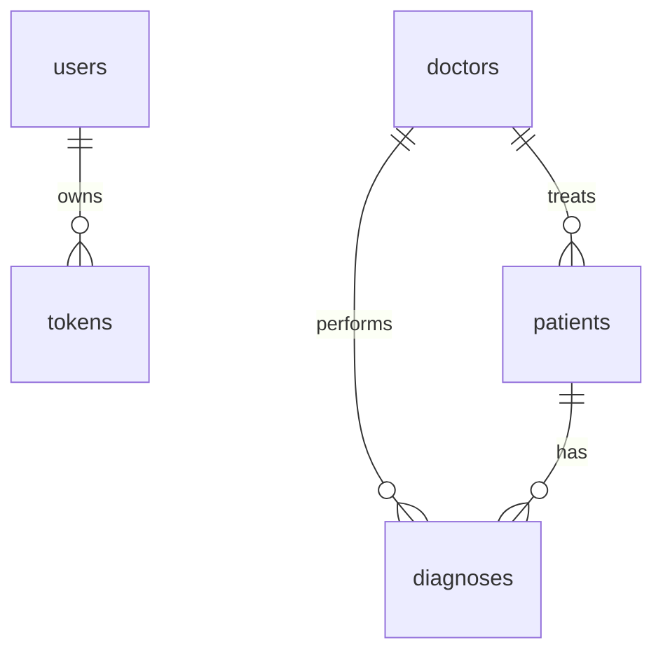

### 📑 목차

1. [백엔드 (Backend)](#백엔드-backend)  
   1.1 [아키텍처 개요](#아키텍처-개요)  
   1.2 [구성 파일 (Configs)](#구성-파일-configs)  
   1.3 [메인 엔트리 (main.py)](#메인-엔트리-mainpy)  
   1.4 [의존성 주입 (Dependency)](#의존성-주입-dependency)  
   1.5 [핵심 모듈 (Core)](#핵심-모듈-core)  
   1.6 [미들웨어 (Middleware)](#미들웨어-middleware)  
   1.7 [DTO](#dto)  
   1.8 [모델 (Models)](#모델-models)  
   1.9 [저장소 (Repositories)](#저장소-repositories)  
   1.10 [스키마 (Schemas)](#스키마-schemas)  
   1.11 [서비스 (Services)](#서비스-services)  
   1.12 [컨트롤러 (Controllers)](#컨트롤러-controllers)  
   1.13 [마이그레이션 (Migrations)](#마이그레이션-migrations)  
   1.14 [템플릿 (Templates)](#템플릿-templates)  
   1.15 [문서 (Docs)](#문서-docs)  
   1.16 [테스트 (Tests)](#테스트-tests)  

## 백엔드 (Backend)

### 아키텍처 개요

```mermaid
C4Context
  title 시스템 컨텍스트 다이어그램
  Enterprise_Boundary(e1, "의료 진단 시스템") {
    Container\web_app("FastAPI 백엔드", "Python\nFastAPI, SQLAlchemy", "REST API, WebSocket 제공")
    Container_Db("PostgreSQL", "Relational Database")
    Container_S3("AWS S3", "객체 스토리지")
  }
  Container\web_app --> Container_Db : "ORM을 통해 쿼리"
  Container\web_app --> Container_S3 : "파일 업로드/다운로드"
  System_Ext(user, "클라이언트", "Streamlit 기반 프론트엔드")
  System_Ext(user) --> Container\web_app : "HTTP/WS 요청"
```

### 구성 파일 (Configs)

| 파일 경로                                            | 설명                                                         | 관계 파일                      |
|------------------------------------------------------|--------------------------------------------------------------|-------------------------------|
| **backend/app/configs/env_configs.py**               | 환경 변수 로딩 및 애플리케이션 설정 관리                    | database.py, services, main.py |
| **backend/app/configs/database.py**                  | SQLAlchemy 엔진·세션 정의, Base 메타데이터 바인딩            | env_configs.py, dependency.py  |

---

### 메인 엔트리 (main.py)

- **경로**: `backend/main.py`  
- **주요 역할**  
  - FastAPI 애플리케이션 인스턴스 생성  
  - 미들웨어 및 라우터 등록  
  - WebSocket 엔드포인트 설정  

```python
app = FastAPI()
app.add_middleware(UserAgentMiddleware)
app.include_router(auth_router, prefix="/auth")
...
```

- **관계**  
  - controllers 디렉토리의 모든 라우터  
  - middleware, core, dependency 모듈  

---

### 의존성 주입 (Dependency)

- **경로**: `backend/app/dependency/dependency.py`  
- **주요 함수**  
  - `get_db()` : DB 세션 제공  
  - `get_current_user()` : JWT 토큰으로 사용자 인증  
- **관계**  
  - repositories/user_repository.py  
  - repositories/token_repository.py  
  - schemas/auth_schema.py  

---

### 핵심 모듈 (Core)

| 파일 경로                                      | 기능                                                         |
|------------------------------------------------|--------------------------------------------------------------|
| **backend/app/core/templating.py**             | Jinja2 기반 HTML 템플릿 렌더링 지원                          |
| **backend/app/core/ws_connection_manager.py**  | WebSocket 커넥션 관리, 브로드캐스트 기능                      |

---

### 미들웨어 (Middleware)

- **경로**: `backend/app/middleware/user_agent_middleware.py`  
- **기능**  
  - 요청 헤더의 User-Agent 검사 및 로깅  
  - 필요한 경우 헤더 추가/변경  

---

### DTO

> HTTP 요청·응답 바디 정의를 위한 Pydantic 모델 모음

| 파일                                    | 설명                          | 사용처                                   |
|-----------------------------------------|-------------------------------|----------------------------------------|
| `auth_dto.py`                           | 로그인·회원가입 요청/응답 스키마  | auth_controller, auth_service          |
| `diagnosis_dto.py`                      | 진단 시작/결과 요청 스키마        | diagnosis_web_controller, services     |
| `doctor_dto.py`                         | 의사 관련 CRUD 요청 스키마         | doctor_controller, doctor_service      |
| `patient_dto.py`                        | 환자 관련 CRUD 요청 스키마         | patient_controller, patient_service    |
| `user_dto.py`                           | 사용자 상세 정보 응답 스키마       | auth_controller, user_repository       |

---

### 모델 (Models)

> SQLAlchemy ORM 정의



| 파일                                | 테이블        | 주요 관계                                |
|-------------------------------------|--------------|-------------------------------------------|
| `base_model.py`                     | 모든 모델의 공통 필드(id, timestamps) | 상속 대상                                |
| `user.py`                           | users        | 1:N tokens                               |
| `token.py`                          | tokens       | N:1 users                                |
| `doctor.py`                         | doctors      | 1:N patients, 1:N diagnoses              |
| `patient.py`                        | patients     | N:1 doctors, 1:N diagnoses               |
| `diagnosis.py`                      | diagnoses    | N:1 patients, N:1 doctors                |

---

### 저장소 (Repositories)

> DB 접근 추상화 계층

| 파일                                    | 기능                     | 의존성         |
|-----------------------------------------|--------------------------|--------------|
| `user_repository.py`                    | User CRUD               | Session      |
| `token_repository.py`                   | Token CRUD              | Session      |
| `doctor_repository.py`                  | Doctor CRUD             | Session      |
| `patient_repository.py`                 | Patient CRUD            | Session      |
| `diagnosis_repository.py`               | Diagnosis CRUD          | Session      |

---

### 스키마 (Schemas)

> FastAPI 요청·응답 검증용 Pydantic 스키마

| 파일                         | 용도                          |
|------------------------------|-------------------------------|
| `auth_schema.py`             | /auth 엔드포인트 바디 검증     |
| `patient_schema.py`          | /patients 바디 검증           |
| `diagnosis_schema.py`        | /diagnosis 바디 검증          |
| `ws_schema.py`               | WebSocket 메시지 포맷 검증    |

---

### 서비스 (Services)

| 파일                                    | 역할                                                         | 관계                                  |
|-----------------------------------------|--------------------------------------------------------------|---------------------------------------|
| `auth_service.py`                       | 회원가입, 로그인, JWT 발급/리프레시                           | repositories/user, token, utils/jwt    |
| `patient_service.py`                    | 환자 CRUD 비즈니스 로직                                       | repositories/patient                  |
| `doctor_service.py`                     | 의사 CRUD 비즈니스 로직                                       | repositories/doctor                   |
| `diagnosis_service.py`                  | 진단 워크플로우 관리                                          | repositories/diagnosis, s3_service    |
| `diagnosis_password_manager.py`         | 세션별 비밀번호 생성/검증                                      |                                       |
| `diagnosis_result_process.py`           | 진단 결과 후처리 로직                                         |                                       |
| `s3_service.py`                         | AWS S3 파일 업로드/다운로드                                  | boto3                                |

---

### 컨트롤러 (Controllers)

> FastAPI 라우터 정의

| 파일                                              | 엔드포인트 예시                                                         |
|---------------------------------------------------|-------------------------------------------------------------------------|
| **auth_controller.py**                            | POST `/auth/signup`, `/auth/login`, `/auth/refresh`                     |
| **patient_controller.py**                         | GET/POST `/patients`, GET/PUT/DELETE `/patients/{id}`                   |
| **diagnosis_web_controller.py**                   | POST `/diagnosis/start`, GET `/diagnosis/status/{session_id}`          |
| **diagnosis_record_controller.py**                | GET `/diagnosis_records`, POST `/diagnosis_records`                     |
| **diagnosis_ws_controller.py**                    | WebSocket `/ws/diagnosis/{session_id}`                                  |
| **mock_client_controller.py**                     | GET `/mock_vr_client` (HTML 템플릿 반환)                                |

각 컨트롤러는 해당 DTO·서비스를 호출하여 요청을 처리한다.

---

### 마이그레이션 (Migrations)

| 파일/폴더                                              | 설명                                |
|--------------------------------------------------------|-------------------------------------|
| `alembic.ini`                                          | Alembic 설정                         |
| `migrations/env.py`                                    | Alembic 환경 구성                    |
| `migrations/versions/b6e30fbd6762_init_db.py`          | 초기 테이블 생성                     |
| `migrations/reset_db.py`                               | 데이터베이스 리셋 스크립트            |
| `migrations/script.py.mako`                           | 마이그레이션 스크립트 템플릿          |
| `migrations/README`                                    | 사용 가이드                          |

---

### 템플릿 (Templates)

- **경로**: `backend/templates/mock_vr_client.html`  
- **설명**: VR 모의 클라이언트를 위한 HTML·JS 뷰. WebSocket/SSE 연결 UI 제공.

---

### 문서 (Docs)

- **경로**: `backend/docs/websocket_api_docs.json`  
- **설명**: WebSocket 메시지 스펙 정의. 클라이언트에서 API 문서 자동 생성에 활용.

---

### 테스트 (Tests)

> 통합 및 단위 테스트

| 파일 경로                                                       | 유형      | 대상 모듈                          |
|-----------------------------------------------------------------|----------|-----------------------------------|
| `tests/api_integration/conftest.py`                             | Fixture  | DB 세션, 테스트 클라이언트         |
| `tests/api_integration/test_auth.py`, `test_patient.py`, `test_diagnosis.py` | Integration | Auth, Patient, Diagnosis API      |
| `tests/test_time.py`                                            | Unit     | utils/time.py                     |
| `tests/test_user_agent_middleware.py`                           | Unit     | middleware/user_agent_middleware.py |
